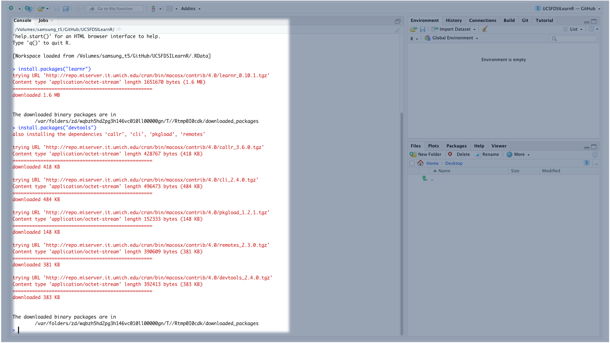
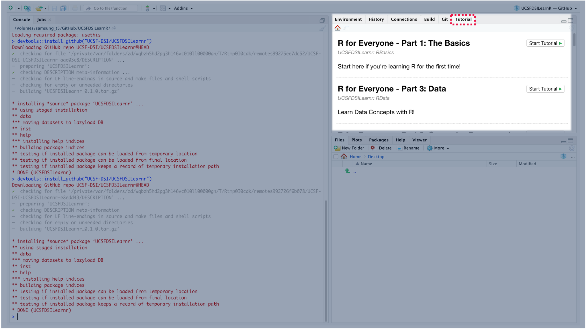
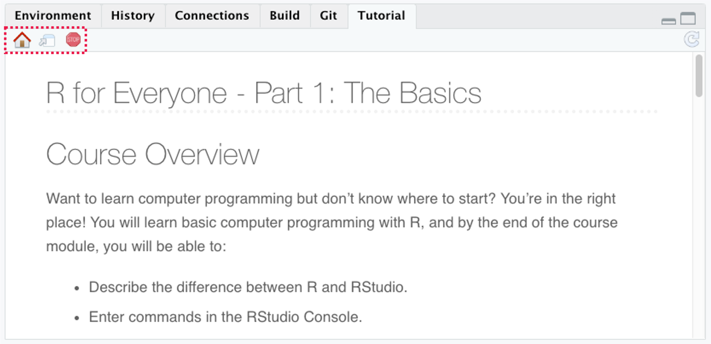

# Course Access Instructions

You'll need to have R and RStudio installed, and you'll access the self-paced R for Everyone course directly inside of RStudio!

To access the course, open RStudio, and you'll need to complete the following steps:

1.  Install learnr and devtools

2.  Load learnr and devtools

3.  Install Course

4.  Launch Lessons

## Install learnr and devtools

You can skip this step of you've already previously installed *learnr* and *devtools* packages. However, there is not harm in re-installing these packages.

To install learnr and devtools, copy and paste the commands below into RStudio Console and press *Enter*.

    install.packages("learnr")
    install.packages("devtools")

## Load learnr and devtools

After you've installed *learnr* and *devtools*, you'll need to load them in your RStudio session. To do this, copy and paste the commands below into RStudio Console and press *Enter*.

    library(learnr)
    library(devtools)

## Install Course

After you'd loaded *learnr* and devtools, you can install course. UCSF DSI courses are regularly updated, and you should install the course every time to ensure you are viewing the most up-to-date version of the course.

    devtools::install_github("UCSF-DSI/r4dm")

## Launch Lesson

Now that the course has been installed, you can access the lessons in the Tutorial Pane at the top right of RStudio.

The lessons in this course are:

1.  Data Frames

2.  The Tidyverse

3.  Subset

4.  Mutate

5.  (pending release) Summarize

6.  (pending release) Concatenate

7.  (pending release) Joins

Begin a lesson by clicking *Start Tutorial*. We recommend viewing the lesson in a new window, and to do that, you'll just need to click the *Show in new window* icon at the top left of the Tutorial Pane.

You can stop or pause the lesson at any time, and RStudio will remember your progress.
