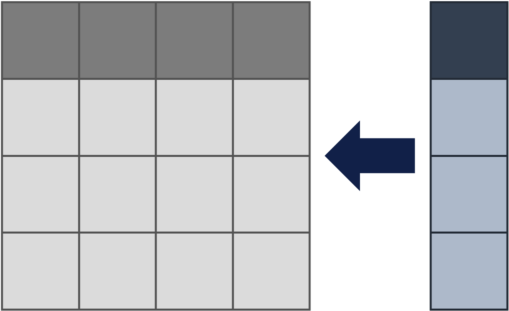

```{r setup, include=FALSE}
library(learnr)
library(tidyverse)
knitr::opts_chunk$set(echo = FALSE)
```

```{r exercise_setup, include=FALSE}
course_records <- read.csv(url("https://raw.githubusercontent.com/UCSF-DSI/UCSFDSILearnr/main/data/course_records.csv"))
```

## Getting Started

Take a look at the code below:

```{r getting_started_01, exercise=TRUE, exercise.setup="exercise_setup"}
course_records %>%
  filter(
    (
      Week.1.Attendance +
      Week.2.Attendance +
      Week.3.Attendance +
      Week.4.Attendance +
      Week.5.Attendance
    ) > 2
  ) %>%
  select(Name, Grade)
```

If we were to describe it, it'd be something along the lines of this:

*"Select the name and grade of students whose week 1 attendance plus week 2 attendance plus week3 attendance plus week 4 attendance plus week 5 attendance is greater than 2"*

Wouldn't it be nice if we could just say *total attendance* instead of *week 1 attendance plus week 2 attendance plus week3 attendance plus week 4 attendance plus week 5 attendance*?

This is where mutate comes in.

## Mutate

{width="40%"}

The **mutate** function (`mutate()`) changes existing columns or creates new ones. For example, we can create a new column called *total_attendance* to represent the sum of all the attendance columns.

```{r mutate_01, exercise=TRUE, exercise.setup="exercise_setup"}
course_records %>%
  mutate(
    total_attendance = Week.1.Attendance + Week.2.Attendance + Week.3.Attendance + Week.4.Attendance + Week.5.Attendance
  )
```

It is generally a good idea to mutate columns before doing any subsetting. That way, you can use the columns you adjusted or created in `filter()` or `select()`.

```{r mutate_02, exercise=TRUE, exercise.setup="exercise_setup"}
course_records %>%
  mutate(
    total_attendance = Week.1.Attendance + Week.2.Attendance + Week.3.Attendance + Week.4.Attendance + Week.5.Attendance
  ) %>%
  filter(
    total_attendance > 2
  ) %>%
  select(Name, Grade, total_attendance)
```

## Knowledge Check

Suppose you realized you needed to update the post assessment scores (*Post.Assessment.Score*) because one of the questions on the assessment was invalid. Adjust the code below and add 0.1 to all the post assessment scores before doing the subsetting.

*Hint: You need to add one line of code.*

```{r KC, exercise=TRUE, exercise.lines=10, exercise.setup="exercise_setup"}
library(tidyverse)

course_records %>%
  mutate(
    total_attendance = Week.1.Attendance + Week.2.Attendance + Week.3.Attendance + Week.4.Attendance + Week.5.Attendance
  ) %>%
  filter(
    total_attendance > 2
  ) %>%
  select(Name, Grade, total_attendance, Post.Assessment.Score)
```

```{r KC-solution}
library(tidyverse)

course_records %>%
  mutate(
    total_attendance = Week.1.Attendance + Week.2.Attendance + Week.3.Attendance + Week.4.Attendance + Week.5.Attendance,
    Post.Assessment.Score = Post.Assessment.Score + 0.1
  ) %>%
  filter(
    total_attendance > 2
  ) %>%
  select(Name, Grade, total_attendance, Post.Assessment.Score)
```

## Summary

| Vocabulary        | Definition                                                                                                     |
|:------------------|:---------------------------------------------------------------------------------------------------------------|
| Tidyverse         | A set of R packages designed with the philosophy of aligning code with the language used to describe analysis. |
| Mutate `mutate()` | Create a new column or update an existing one.                                                                 |

**References**

-   Wickham, Hadley, Romain François, Lionel Henry, Kirill Müller. *Create, modify, and delete columns*. <https://dplyr.tidyverse.org/reference/mutate.html>
