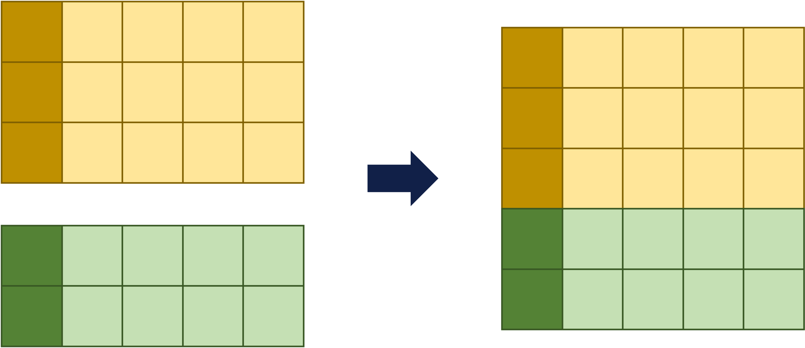

```{r setup, include=FALSE}
library(learnr)
library(tidyverse)
knitr::opts_chunk$set(echo = FALSE)
```

```{r exercise_setup, include=FALSE}
course_records <- read_csv(url("https://raw.githubusercontent.com/UCSF-DSI/r4dm/main/data/course_records/course_records.csv"))
course_records_additional <- read_csv(url("https://raw.githubusercontent.com/UCSF-DSI/r4dm/main/data/course_records/course_records_additional.csv"))
tibble_1 <- read_csv(url("https://raw.githubusercontent.com/UCSF-DSI/r4dm/main/data/course_records/tibble_1.csv"))
tibble_2 <- read_csv(url("https://raw.githubusercontent.com/UCSF-DSI/r4dm/main/data/course_records/tibble_2.csv"))
```

## Getting Started

We have two tibbles: *course_records* and *course_records_additional*. Take a quick look at them by running the code snippets below:

```{r getting_started_01, exercise=TRUE, exercise.setup="exercise_setup"}
course_records
```

```{r getting_started_02, exercise=TRUE, exercise.setup="exercise_setup"}
course_records_additional
```

Although the tibbles contain different rows, the columns are the same. It makes sense here to do our analysis with all the data in a single tibble rather than the data in these separate tibbles.

If only there was a way to **concatenate** or combine the rows of tibbles.

## Concatenating Rows

{width="70%"}

You can use the `bind_rows()` function to concatenate the rows in tibbles. The code snippet below concatenates *course_records* to *course_records_additional.*

```{r concatenate, exercise=TRUE, exercise.setup="exercise_setup"}
combined_course_records <- course_records %>%
  bind_rows(course_records_additional)

combined_course_records
```

## Guidelines

With concatenate, there are things you can do but should avoid. Here are some guidelines you should follow.

### Avoid Concatenating Columns

Technically, you can concatenate columns in multiple tibbles using the `bind_cols()` function. However, combining columns this way often makes data manipulation more difficult in other parts of your analysis. Here are other things you should consider before using `bind_cols()`.

-   Make sure each row in your tibble represents an observation and each column represents a variable. *Long* tibbles are generally preferred over *wide* ones.

-   Use `mutate()` to create new columns.

### Concatenate Tibbles with the Same Columns

Similar to above, you can technically concatenate tibbles with different columns, but this often leads to mistakes in other parts of your analysis. Here are some alternative approaches you should consider:

-   Select the columns you would like to keep before concatenating the tibbles.

-   If very few of the columns between the tibbles match, consider doing a *join* or *merge* instead of concatenation. You will learn more about this in *R for Data Manipulation Part 7: Joins*).

## Knowledge Check

```{r KC-1, echo=FALSE}
question("TRUE or FALSE: You should use `bind_rows()` to combine tibbles with different columns.",
  answer("TRUE ", message = "Not quite. Just because you can doesn't mean you should!"),
  answer("FALSE ", correct = TRUE),
  type="single",
  allow_retry = TRUE
)
```

## Summary

| Vocabulary                  | Definition                            |
|:----------------------------|:--------------------------------------|
| concatenate (`bind_rows()`) | Combine the rows of multiple tibbles. |

**References**

-   Wickham, Hadley, Romain François, Lionel Henry, Kirill Müller. *Efficiently bind multiple data frames by row and column*. <https://dplyr.tidyverse.org/reference/bind.html>
